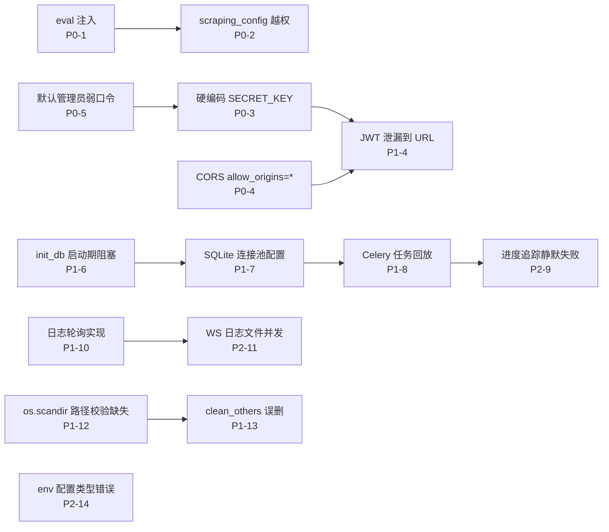

# Bonita 系统严重问题清单

> 探索模式自动排查产物 · 2026-07-21（更新于 2026-07-21 晚间审计后）
> 范围：`backend/bonita`（FastAPI + Celery + SQLite + watchdog）与 `frontend/src`（Vue 3 + Vite + Pinia）
> 评级：**P0 安全/数据丢失** · **P1 正确性/可用性** · **P2 稳健性/可维护性**

---

## 修复状态总览

### 原始 14 项问题（SYSTEM_ISSUES v1）

| 编号 | 问题 | 状态 | 修复来源 |
|------|------|------|----------|
| P0-1 | eval() 任意代码执行 | ✅ 已修复 | `harden-auth-and-secrets` |
| P0-2 | 写操作缺少超级管理员校验 | ✅ 已修复 | `harden-auth-and-secrets` |
| P0-3 | SECRET_KEY 硬编码 | ✅ 已修复 | `harden-auth-and-secrets` |
| P0-4 | CORS allow_origins=* | ✅ 已修复 | `harden-auth-and-secrets` |
| P0-5 | 默认管理员弱口令 | ✅ 已修复 | `harden-auth-and-secrets` |
| P1-6 | init_db 启动期阻塞 | ✅ 已修复 | `fix-task-lifecycle-and-safety` |
| P1-7 | SQLite pool_size 被忽略 | ✅ 已修复 | `fix-task-lifecycle-and-safety` |
| P1-8 | Celery 嵌套 get() 死锁风险 | ❌ 未修复 | 需架构重构 |
| P1-9 | 日志字符串未使用 f-string | ✅ 已修复 | `fix-task-lifecycle-and-safety` |
| P1-10 | WS 日志全量读取 + 轮询 | ❌ 未修复 | 需重写 WS 日志 |
| P1-11 | file_browser 路径遍历 | ✅ 已修复 | `fix-task-lifecycle-and-safety` |
| P1-12 | clean_others 误删 | ✅ 已修复 | `fix-input-validation-and-data-safety` |
| P1-13 | sort_by 可注入任意属性 | ✅ 已修复 | `fix-input-validation-and-data-safety` |
| P1-14 | WS JWT 通过 URL 传递 | ✅ 已修复 | `fix-input-validation-and-data-safety` |
| P2-15 | MAX_CONCURRENT_TASKS 类型错误 | ✅ 已修复 | `fix-input-validation-and-data-safety` |
| P2-16 | WatchHistory 无 user_id | ❌ 未修复 | 产品定位决定 |
| P2-17 | get_password_hash 返回 bytes | ✅ 已修复 | `harden-auth-and-secrets` |
| P2-18 | init_db 文件存在性判断脆弱 | ✅ 已修复 | `fix-task-lifecycle-and-safety` |
| P2-19 | Celery 异常被装饰器吞掉 | ✅ 已修复 | `fix-task-lifecycle-and-safety` |
| P2-20 | update_task_config 未校验 id | ✅ 已修复 | `fix-input-validation-and-data-safety` |

**原始问题修复率：17/20 = 85%**

### 审计新发现（2026-07-21 晚间）

**后端（4 项）→ OpenSpec change: `fix-backend-audit-bugs`**

| 编号 | 问题 | 严重性 | 状态 |
|------|------|--------|------|
| NEW-1 | `destpath=None` 时 `os.path.exists` 抛 TypeError | P1 | 待修复 |
| NEW-2 | WS 日志正则 message 含 PID/TID 前缀（噪声） | P2 | 待修复 |
| NEW-3 | WebSocket 双重 `accept()` 调用 | P1 | 待修复 |
| NEW-4 | `LOGGING_LOCATION` 相对路径在 Celery 中解析不一致 | P2 | 待修复 |

**前端（17 项）→ OpenSpec change: `fix-frontend-race-conditions`**

| 组件 | 问题数 | 关键问题 |
|------|--------|----------|
| Records.vue | 7 | 请求竞态、生命周期泄漏、localStorage 校验缺失 |
| ScrapeLogDrawer.vue | 6 | 请求竞态、轮询重叠、错误静默 |
| Logs.vue | 4 | WS 事件过期、认证错误无 UI 反馈 |

---

## 原始问题详情

本次共发现 **14 项严重问题**，分布如下：

| 领域 | P0 | P1 | P2 |
|---|---|---|---|
| 认证 / 授权 | 2 | 1 | — |
| 代码注入 | 1 | — | — |
| 数据完整性 | 1 | 2 | 1 |
| 配置 / 部署 | — | 2 | 1 |
| 日志 / 可观测性 | — | 1 | 1 |
| 并发 / 任务系统 | — | 1 | 1 |

问题依赖关系：



---

## P0 · 安全与数据丢失

### P0-1 · `eval()` 任意代码执行（刮削规则字段）

**位置**：`backend/bonita/celery_tasks/tasks.py:483-487`

```python
extra_folder = eval(scraping_conf.location_rule, metadata_mixed.__dict__)
extra_name = eval(scraping_conf.naming_rule, metadata_mixed.__dict__)
```

**问题**：`location_rule` / `naming_rule` 来自 `ScrapingConfig` 表，用户可通过 API 自由写入字符串，随后在 Celery worker 进程内被 `eval()` 执行。`__dict__` 作为 globals 传入，意味着 `__import__`、`os.system`、`open(...).write(...)` 等任意表达式都能跑通。

**攻击路径**：任何登录用户（即使是普通用户）→ `PUT /api/v1/scraping/config/{id}` 提交 `location_rule="__import__('os').system('rm -rf /')"` → 触发任意刮削任务 → worker 执行任意命令。

**修复方向**：用受限模板引擎（`str.format_map` + 白名单字段、或 `ast.literal_eval` 仅字面量）替换 `eval`；或预编译为 `lambda m: ...` 形式并限制可用属性。

---

### P0-2 · 写操作缺少超级管理员校验

**位置**：

- `backend/bonita/api/routes/scraping_config.py:37-67`（PUT / DELETE）
- `backend/bonita/api/routes/task_config.py:44-85`（PUT / DELETE）
- `backend/bonita/api/routes/settings.py`（全部 Emby/Jellyfin/Transmission/代理 读写）

**问题**：这些路由仅在 `api/main.py:9-28` 通过 `Depends(verify_token)` 做了"已登录"校验，但 **没有** `Depends(get_current_active_superuser)`。任何登录用户（包括 `USERS_OPEN_REGISTRATION=True` 时注册的普通用户）都可以：

- 修改/删除刮削配置（配合 P0-1 直接 RCE）
- 修改/删除转移任务配置
- 修改 Emby / Transmission 凭据（可截获或重定向到攻击者服务器）
- 修改代理设置（可劫持所有出站刮削流量）

**对照**：`users.py:30-31` 中 `create_user` 正确使用了 `Depends(get_current_active_superuser)`。说明这套机制是现成的，只是没被一致应用。

**修复方向**：所有变更类端点（POST/PUT/DELETE）以及敏感设置读取，统一追加 `get_current_active_superuser` 依赖。

---

### P0-3 · `SECRET_KEY` 硬编码为 `"secret key"`

**位置**：`backend/bonita/core/config.py:70`

```python
SECRET_KEY: str = "secret key"
```

**问题**：JWT 签名密钥是源码常量。任何能读到源码（开源仓库）的人都能伪造任意用户的 JWT，包括超级管理员。注释 `# SECRET_KEY: str = secrets.token_urlsafe(32)` 显示开发者曾考虑随机生成但放弃了——可能是为了避免重启后已签发 token 失效。

**影响**：认证机制完全失效，等同于无认证。

**修复方向**：首次启动时随机生成并写入 `./data/config.yaml`（已有 YAML 配置源支持，见 `YamlConfigSettingsSource`），之后从文件读取；或要求部署方通过环境变量提供。

---

### P0-4 · CORS 允许所有来源 + 允许凭证

**位置**：`backend/bonita/core/config.py:74` + `backend/bonita/main.py:30-36`

```python
BACKEND_CORS_ORIGINS: list = ["*"]
# ...
allow_origins=settings.BACKEND_CORS_ORIGINS,
allow_credentials=True,
```

**问题**：`allow_origins=["*"]` + `allow_credentials=True` 是浏览器规范明确禁止的组合——现代浏览器会拒绝携带凭证的跨域请求。但更危险的是：即使某些客户端不严格执行，任意网页都能以用户身份调用本服务 API（结合 P1-4 的 token 在 URL 中泄露，攻击面更大）。

**修复方向**：默认改为空列表，通过配置文件/环境变量显式指定可信来源；`allow_credentials` 仅在确有 cookie 需求时启用（当前是 Bearer Token，应设为 False）。

---

### P0-5 · 默认管理员弱口令 + 未强制修改

**位置**：

- `backend/bonita/core/config.py:76-78`：`FIRST_SUPERUSER="admin"` / `FIRST_SUPERUSER_EMAIL="admin@example.com"` / `FIRST_SUPERUSER_PASSWORD="changepwd"`
- `backend/bonita/core/db.py:24-38`：首次启动自动创建
- `dev.sh:112`：开发脚本也用同一弱口令
- `docker/Dockerfile`：未覆盖

**问题**：Docker 镜像公开分发，任何直接拉取运行且未改默认配置的实例，攻击者用 `admin@example.com / changepwd` 即可登录并获得超级管理员权限。无首次登录强制改密机制。

**修复方向**：首次启动生成随机密码并打印到日志/文件；或要求环境变量必填，缺失则拒绝启动。

---

## P1 · 正确性与可用性

### P1-6 · 启动期阻塞：`init_db()` 在模块加载时执行

**位置**：`backend/bonita/main.py:44-53`

```python
app = create_app()
app.celery_app = celery
init_log_config()
logger = logging.getLogger(__name__)
logger.info(f"Bonita version: {__version__}")
init_db()       # ← 模块导入即执行 Alembic 迁移
init_service()  # ← 启动 MonitorService 线程、Emby 初始化
```

**问题**：

1. `init_db()` 在模块顶层执行，而不是 FastAPI 的 `lifespan` / `startup` 事件。意味着任何导入 `bonita.main` 的进程（包括 Celery worker、测试、`alembic` 自身、OpenAPI 生成脚本）都会触发数据库迁移和表创建。
2. `upgrade_db()` 调用 Alembic `upgrade(head)` 是阻塞操作，多个 worker / uvicorn reload 子进程并发启动时会互相踩踏（SQLite 文件锁）。
3. `init_service()` 启动 watchdog Observer 线程，但 FastAPI 关闭时没有对应的 shutdown hook 停止它们（`stop_monitor` 定义了但从未被调用）。

**修复方向**：迁移到 `app.add_event_handler("startup", ...)` 或 `lifespan`；或至少用 `if __name__ == "uvicorn"` 守卫。

---

### P1-7 · SQLite 使用 `pool_size` / `max_overflow`（被静默忽略）+ 启动期连接竞争

**位置**：`backend/bonita/db/__init__.py:9-15`

```python
engine = create_engine(
    settings.SQLALCHEMY_DATABASE_URI,
    connect_args={"check_same_thread": False},
    pool_size=5,
    max_overflow=10,
    pool_pre_ping=True,
)
```

**问题**：SQLAlchemy 的 `QueuePool` 在 SQLite 默认 `SingletonThreadPool`/`NullPool` 之外才支持 `pool_size`。对 `sqlite:///` URI，除非显式指定 `poolclass=QueuePool`，这些参数会被忽略或告警。同时：

- Celery broker 也用同一个 SQLite 文件（`CELERY_BROKER_URL = f"sqla+sqlite:///{DATABASE_LOCATION}"`，见 `config.py:61`），意味着 **任务队列与业务数据共用一个 SQLite 文件**。Celery 在高并发下会频繁写 broker 表，触发 `database is locked`，进而影响所有 API 请求。
- `check_same_thread=False` 让 SQLite 连接可跨线程，但 SQLite 的写锁是文件级的，多线程写入仍会串行化并可能超时（`busy_timeout=5000` 仅 5 秒）。

**修复方向**：为生产环境推荐 Redis 作为 broker（代码已支持 `CELERY_BROKER_URL` 环境变量覆盖，但默认值危险）；SQLite 场景显式用 `NullPool` 避免连接复用问题。

---

### P1-8 · Celery 任务组 `apply_async` + `allow_join_result` 嵌套等待

**位置**：`backend/bonita/celery_tasks/tasks.py:60-72`、`215-217`、`395-399`

```python
# celery_transfer_entry 中
transfer_group = group(celery_transfer_group.s(...) for entry in dirs)
transfer_result = transfer_group.apply_async()
with allow_join_result():
    done_list = transfer_result.get()

# celery_transfer_group 中又调用
scraping_task = celery_scrapping.apply(args=[...])
with allow_join_result():
    metabase_json = scraping_task.get()
```

**问题**：

1. `celery_transfer_entry` 是一个 Celery 任务，在自身执行中 `get()` 等待子任务组完成，会 **长时间占用一个 worker 线程** 仅做等待。配合 `worker_prefetch_multiplier=1` 和 `MAX_CONCURRENT_TASKS` 信号量（见 P2-14），极易出现所有 worker 都在等子任务、而子任务排在队列后面拿不到 worker 的死锁。
2. `transfer:all` 任务装饰器有 `autoretry_for=(Exception,)` + `retry_backoff=True`，但任务体内部已经 `get()` 了子任务结果。如果子任务失败抛异常，父任务会重试，**重新触发整个转移任务**，导致已成功的文件被重复处理（虽然 `record.success` 会被检查，但 `force_refresh` 路径无幂等保护）。
3. `celery_transfer_group` 的 `except` 块在 `finally` 之前捕获异常并 `record.success = False`，但 `manage_celery_task` 装饰器（`decorators.py:50-56`）又捕获同一异常标记 `fail_task`——双重处理可能导致状态不一致。

**修复方向**：用 `chord` 或 `chain` 替代嵌套 `get()`；或把 `transfer:all` 改成仅调度、不等待的"启动器"。

---

### P1-9 · 日志字符串未使用 f-string（异常信息丢失）

**位置**：

- `backend/bonita/celery_tasks/tasks.py:564`：`logger.error("## [Emby扫描] ✗ 失败: {str(e)}")`
- `backend/bonita/celery_tasks/tasks.py:656`：`logger.error("## [NFO导入] ✗ 失败: {str(e)}")`

**问题**：字符串中没有 `f` 前缀，`{str(e)}` 会被原样打印，实际异常信息完全丢失。这两个任务失败时，日志里只能看到字面量 `{str(e)}`，无法排查。

**修复方向**：改为 `logger.error(f"... 失败: {e}")` 或 `logger.error("... 失败: %s", e)`。

---

### P1-10 · WebSocket 日志监控：全文件读取 + 轮询 + 无日志轮转感知

**位置**：`backend/bonita/api/websockets/logs.py:85-168`

```python
# 连接时读取整个日志文件
with open(log_file_path, "r", encoding="utf-8") as f:
    lines = f.readlines()
# ...
# 持续轮询
while not self.stop_flag and self.active_connections:
    new_size = os.path.getsize(log_file_path)
    if new_size > file_size:
        f.seek(file_size)
        new_content = f.read()
```

**问题**：

1. **全量读取**：每次新客户端连接，`readlines()` 一次性把整个日志文件（最高 5MB × 5 备份 = 25MB 主文件）读入内存并解析正则。多个客户端同时连接会重复读取。
2. **日志轮转未感知**：`RotatingFileHandler`（`logger.py:28`）在文件达到 5MB 时会 `rotate`，主文件被重命名为 `bonita.log.1`，新文件从 0 开始。此时 `new_size < file_size`，代码的 `if new_size > file_size` 分支不会进入，**新日志全部丢失**，直到客户端重连。
3. **轮询间隔 0.5s**：即使没有新日志也每秒唤醒 2 次文件系统调用，SMB/NFS 挂载场景下成本更高。
4. **单例 `log_manager`**：全局共享一个 `LogConnectionManager`，但 `monitor_log_file` 是 `asyncio.create_task`，如果多个连接几乎同时建立，`log_task` 的判空 `if self.log_task is None or self.log_task.done()` 存在竞态，可能启动多个监控任务。
5. **正则只匹配一种格式**：`r"\[(.*?)\] (\w+) in ([\w\.]+): (.*)"` 与 `LOGGING_FORMAT` 中的 `PID:%(process)d TID:%(thread)d [%(task_id)s]` 段不匹配，大量日志行会被静默丢弃。

**修复方向**：用 `watchdog` 监听日志文件变化 + `tail -f` 式增量读取；或直接接入 Python `logging` 的内存 handler 推送。

---

### P1-11 · `file_browser` 路径参数无校验，可遍历全盘

**位置**：`backend/bonita/api/routes/file_browser.py:13-82`

```python
@router.get("/list", response_model=schemas.FileListResponse)
async def list_directory(
        session: SessionDep,
        directory_path: str = Query(None, description="要浏览的目录路径"),
        ):
    # 直接 os.scandir(directory_path)
```

**问题**：`directory_path` 无任何校验或根目录限制。任何登录用户可调用 `GET /api/v1/files/list?directory_path=/etc` 或 `C:\Windows\System32` 读取宿主机任意目录的文件名、大小、修改时间。结合 P0-2（普通用户也能访问），信息泄露面很大。

虽然该路由有 `verify_token`，但未限制可浏览范围，等同于给了登录用户一个"任意目录列举器"。

**修复方向**：限制可浏览根目录（如任务配置的 `source_folder` / `output_folder` 子树），或仅允许超级管理员。

---

### P1-12 · `celery_clean_others` 误删风险

**位置**：`backend/bonita/celery_tasks/tasks.py:535-549`

```python
def celery_clean_others(self, root_path, done_list):
    dest_list = findAllFilesWithSuffix(root_path, video_type)
    for dest in dest_list:
        if dest not in done_list:
            cleaned_files.append(dest)
    for torm in cleaned_files:
        os.remove(torm)
```

**问题**：该任务会删除 `output_folder` 下所有"不在本次 `done_list` 中"的视频文件。但：

1. `done_list` 在 `celery_transfer_entry` 中经过 `list(set(done_list))` 去重（line 84），路径字符串的微小差异（软链接 vs 硬链接、`./` 前缀、符号链接解析）都会导致 `not in` 判定为真。
2. 如果两个转移任务共用同一 `output_folder`，任务 A 的 `done_list` 不包含任务 B 之前转移的文件，A 的清理任务会删掉 B 的成果。
3. `done_list` 通过 Celery 任务参数传递，如果某次子任务异常返回空列表，父任务的 `done_list` 会缺失条目，触发误删。
4. 异常无回滚：`os.remove` 失败会抛异常，但已删除的文件不会恢复。

**修复方向**：`clean_others` 应基于 `TransRecords` 表中该 `output_folder` 的成功记录，而非内存中的 `done_list`。

---

### P1-13 · `get_media_items` 排序字段可注入任意 `MediaItem` 属性

**位置**：`backend/bonita/api/routes/mediaitem.py:21,104-105`

```python
sort_by: str = "updatetime",
# ...
sort_column = getattr(MediaItem, sort_by, MediaItem.updatetime)
query = query.order_by(desc(sort_column) if sort_desc else asc(sort_column))
```

**问题**：`sort_by` 直接传入 `getattr(MediaItem, sort_by, ...)`。虽然 SQLAlchemy 列对象用于 `order_by` 通常是安全的，但 `MediaItem` 上可能有 `relationship`、`__dict__` 中的方法等非列属性。传入 `sort_by="__init__"` 之类不会直接 RCE，但传入 `sort_by="series"`（relationship）会导致生成的 SQL 异常或未定义行为。

同类问题：`record_service.py:74` 的 `sort_field = getattr(TransRecords, sort_by, TransRecords.updatetime)`。

**修复方向**：白名单校验 `sort_by in {"updatetime", "createtime", "title", ...}`。

---

### P1-14 · WebSocket JWT 通过 URL 查询参数传递

**位置**：`frontend/src/pages/Logs.vue:195`

```typescript
const wsUrl = `${protocol}//${host}/api/v1/ws/logs?token=${token}`
```

**问题**：JWT 被放进 URL 查询参数。URL 会出现在：

1. 服务器访问日志（nginx、uvicorn）
2. 浏览器历史记录
3. `Referer` 头（如果日志页面有外链）
4. 代理服务器日志

即使后端 `verify_ws_token`（`logs.py:17-28`）正确验证了 token，传递方式本身已泄露。结合 P0-3（硬编码 SECRET_KEY），攻击者可从任意代理日志伪造 token。

**修复方向**：WebSocket 建立后先用第一条消息发送 token 认证，或用 `Sec-WebSocket-Protocol` 子协议头传递。

---

## P2 · 稳健性与可维护性

### P2-15 · `MAX_CONCURRENT_TASKS` 环境变量类型错误

**位置**：`backend/bonita/core/config.py:64`

```python
MAX_CONCURRENT_TASKS: int = os.environ.get("MAX_CONCURRENT_TASKS", 5)
```

**问题**：`os.environ.get` 返回 `str | None`，但默认值 `5` 是 `int`，类型注解写的是 `int`。

- 未设置环境变量时：`MAX_CONCURRENT_TASKS = 5`（int），`Semaphore(5)` 正常。
- 设置了环境变量（如 Dockerfile 中 `ENV MAX_CONCURRENCY=1`，但这里是 `MAX_CONCURRENT_TASKS`）时：`MAX_CONCURRENT_TASKS = "5"`（str），`Semaphore("5")` 会抛 `TypeError: '<' not supported between 'str' and 'int'`。

Dockerfile 设置的是 `MAX_CONCURRENCY` 而非 `MAX_CONCURRENT_TASKS`，两者命名不一致，环境变量覆盖实际上不生效。

**修复方向**：`int(os.environ.get("MAX_CONCURRENT_TASKS", "5"))`，并统一命名。

---

### P2-16 · `WatchHistory` 无 `user_id`，多用户数据混存

**位置**：`backend/bonita/db/models/watch_history.py`

**问题**：`WatchHistory` 表只有 `media_item_id` 外键，没有 `user_id`。所有用户的观看记录、收藏、评分都混在同一张表里。`mediaitem.py:35-48` 的子查询对 `WatchHistory` 做 `group_by(media_item_id)` 聚合，意味着：

- 用户 A 收藏了某影片，用户 B 的列表里该影片也显示为"已收藏"。
- `users.py` 允许注册多用户（`USERS_OPEN_REGISTRATION` 可开启），但观看历史实际上无法区分用户。

**修复方向**：要么显式标注"单用户系统"并禁用多用户注册；要么补 `user_id` 列并在所有查询中过滤。

---

### P2-17 · `get_password_hash` 返回 `bytes`，存入 `String` 列

**位置**：`backend/bonita/core/security.py:28-35` + `backend/bonita/db/models/user.py:17`

```python
def get_password_hash(password: str) -> str:
    pwd_bytes = password.encode('utf-8')
    salt = bcrypt.gensalt()
    hashed_password = bcrypt.hashpw(password=pwd_bytes, salt=salt)
    return hashed_password   # ← 返回 bytes，注解写的 str

# user.py
hashed_password = Column(String, ...)
```

**问题**：`bcrypt.hashpw` 返回 `bytes`，被直接存入 SQLAlchemy `String` 列。SQLite 的 `String` 列存 `bytes` 会被当成 `BLOB` 或触发 `ProgrammaticError`（取决于驱动版本）。`verify_password` 又用 `bcrypt.checkpw(password=..., hashed_password=...)`，如果 `hashed_password` 从数据库读出后变成 `str`，`checkpw` 会抛 `TypeError`。

目前能"跑通"可能是因为 SQLite + sqlite3 驱动对 `bytes` 的宽松处理，但迁移到 PostgreSQL/MySQL 会立即报错。

**修复方向**：`return hashed_password.decode('utf-8')`，存入和读取都用 `str`。

---

### P2-18 · `init_db` 迁移判断基于文件存在性，脆弱

**位置**：`backend/bonita/core/db.py:12-22`

```python
def init_db():
    location = settings.DATABASE_LOCATION
    if not os.path.exists(location):
        Base.metadata.create_all(bind=engine)
        init_super_user()
        stamp_db()
    else:
        upgrade_db()
```

**问题**：

1. 如果数据库文件存在但为空（手动 `touch`、或写入失败残留），会走 `upgrade_db()` 分支，Alembic 在空库上 `upgrade(head)` 会因为缺少 `alembic_version` 表而报错或建一半表。
2. 如果文件被删但 `data/` 目录下还有 WAL/SHM 文件（`bonita.db.sqlite3-wal`），SQLite 打开时会重建主文件，`os.path.exists` 判定为 False，又走 `create_all`，可能和 WAL 中的未检查点事务冲突。
3. 没有任何锁保护，多进程并发启动时（uvicorn `--reload` 的子进程 + Celery worker 同时启动）可能同时进入 `create_all` 分支。

**修复方向**：用 Alembic 的 `command.current` 判断当前版本，统一走 `upgrade`；首次初始化用 `stamp(head)` + 手动建表脚本。

---

### P2-19 · Celery 任务异常被装饰器吞掉，`retry` 机制失效

**位置**：`backend/bonita/celery_tasks/decorators.py:50-58`

```python
except Exception as e:
    error_message = str(e)
    logger.error(f"Task {task_id} failed: {error_message}")
    with CeleryTaskService() as task_service:
        task_service.fail_task(task_id, error_message)
    # ← 没有 raise
```

**问题**：`manage_celery_task` 装饰器捕获异常后未重新抛出。但 `tasks.py` 中所有任务都声明了 `autoretry_for=(Exception,), retry_backoff=True, retry_kwargs={"max_retries": 3}`——Celery 的自动重试依赖异常向上抛到 Celery runtime。装饰器吞掉异常后，**Celery 认为任务成功完成**，不会重试。

同时 `wrapper` 函数在异常分支没有 `return`，隐式返回 `None`，被 `manage_celery_task` 外层当作"成功结果"处理（虽然 `fail_task` 已标记，但 Celery 层面是 SUCCESS）。

**修复方向**：`except` 块末尾 `raise`，让 Celery 的重试机制生效。

---

### P2-20 · `update_task_config` 未校验 `config_in.id` 与路径 `id` 一致

**位置**：`backend/bonita/api/routes/task_config.py:44-67`

```python
def update_task_config(
    session: SessionDep,
    id: int,
    config_in: schemas.TransferConfigPublic,
) -> Any:
    task_config = session.get(TransferConfig, id)
    # ...
    update_dict = config_in.model_dump(exclude_unset=True)
    task_config.update(session, update_dict)
```

**问题**：`config_in` 是 `TransferConfigPublic`（含 `id` 字段），`update_dict` 会包含 `id`，然后 `task_config.update` 通过 `setattr` 把 `id` 也"更新"了。如果请求体 `id` 与路径 `id` 不同，会把该记录的主键 `id` 改成请求体里的值——SQLite 对主键修改是允许的，会导致记录"身份"错乱，后续 `session.get(TransferConfig, old_id)` 查不到，而 `new_id` 指向了它。

`scraping_config.py:37-53` 的 `update_config` 有同样问题。

**修复方向**：`model_dump(exclude={"id"})` 或用专门的 `Update` schema 不含 `id`。

---

## 附：非严重但值得注意的点

- **`requirements.txt` 未固定版本**：`scrapinglib`、`pillow>=12.1.1`、`python-multipart>=0.0.26` 无精确版本，构建不可复现。
- **`app.celery_app = celery`**（`main.py:45`）：给 FastAPI 实例动态挂属性，类型检查器无法识别，建议用 `app.state.celery_app`。
- **`init_emby` 每次都查 4 次数据库**（`service.py:37-43`）：可合并为一次 `filter(key.in_([...]))`。
- **`EmbyService._make_request` 无超时**：`requests.request(...)` 未传 `timeout`，Emby 服务器无响应时调用方会永久阻塞。
- **`get_poster_url` 的 `size` 参数**：`size.split('w')[-1]` 对 `size="w500"` 得到 `"500"`，但默认值就是 `"w500"`，调用方（`resource.py:132`）没传 size，硬编码在 URL 模板里，灵活性差。
- **前端 `isAdmin = true` 硬编码**（`Logs.vue:53`）：清空日志按钮的显示判断写死为 true，非管理员也能看到按钮（但后端无对应端点，按钮无效）。
- **`dev.ps1` / `dev.sh` 创建管理员用 `changepwd`**：开发环境也用弱口令，如果开发者不慎把开发实例暴露到公网，等同 P0-5。

---

## 修复优先级（更新）

1. ✅ **已完成**：P0-1 ~ P0-5（全部 P0 清零）、P1-6、P1-7、P1-9、P1-11 ~ P1-14、P2-15、P2-17 ~ P2-20
2. **待修复 — 后端审计 bug**（`fix-backend-audit-bugs`）：destpath None 崩溃、双重 WS accept、日志路径
3. **待修复 — 前端竞态**（`fix-frontend-race-conditions`）：请求竞态、轮询重叠、WS 事件过期
4. **架构级**：P1-8（Celery 嵌套 get 死锁）、P1-10（WS 日志全量读取）
5. **产品决策**：P2-16（WatchHistory 无 user_id）

---

## OpenSpec 变更追踪

| Change | 覆盖范围 | 状态 |
|--------|----------|------|
| `harden-auth-and-secrets` | P0-2 ~ P0-5, P2-17 | ✅ 已完成 |
| `fix-task-lifecycle-and-safety` | P1-6, P1-7, P1-9, P2-18, P2-19 | ✅ 已完成 |
| `fix-input-validation-and-data-safety` | P1-12 ~ P1-14, P2-15, P2-20 | ✅ 已完成 |
| `records-tabs-and-scrape-logs` | 功能：tabs + scrape_log + skip_on_success | 🔄 50/66（剩余验证） |
| `records-view-customization` | 功能：状态筛选 + 列选择 + 持久化 | 🔄 26/35（剩余验证） |
| `add-records-createtime-sort` | 功能：createtime 排序 | 🔄 8/14（剩余验证） |
| `fix-backend-audit-bugs` | NEW-1 ~ NEW-4 | 📋 已提案，待实施 |
| `fix-frontend-race-conditions` | 前端 17 项竞态/错误处理 | 📋 已提案，待实施 |
